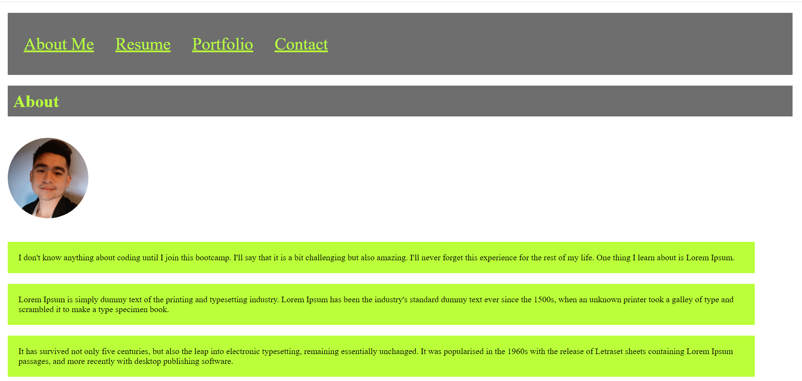

# reactPortfolioJRMH20

## Description
As a future full stack web developer means I am going to be part of a community someday. This application is a place not only to share my projects while applying for jobs or while working as a freelancer but also to share my work with other developers and collaborate on projects in near future.

I created a portfolio using my new React skills, which will help set me apart from other developers whose portfolios don’t use the latest technologies. I deployed this application to GitHub Pages. Following the instructions in the Git Guide and consulting the "Create React App Docs on GitHub Pages" that creates a build.

## Application Screenshot

## Github Links
Application: 

Repository: https://github.com/jzerobby/reactPortfolioJRMH20/tree/gh-pages
